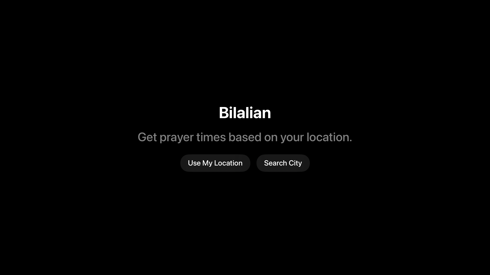
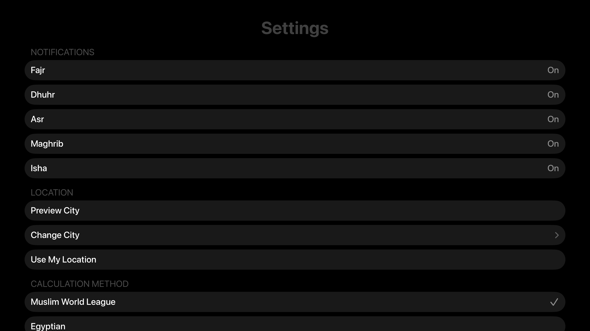

# Bilalian

A tvOS app that displays daily Islamic prayer times and the next upcoming prayer, with location-based calculation and configurable notification preferences.


## Features

- First-launch onboarding for location permission or city search.
- Daily prayer times with next-prayer countdown.
- Per-prayer notification toggles.
- Calculation method selection.
- Gregorian + Hijri date display with current time.
- Time-of-day gradient background.
- Idle timer disabled to keep the display visible.

## Screenshots

| Onboarding | Dashboard | Settings |
| --- | --- | --- |
|  |  |  |

## Tech Stack

- **SwiftUI** for UI.
- **Adhan-Swift** for prayer time calculations.
- **CoreLocation** for current location.
- **MapKit** for city search.
- **UserNotifications** (no-op on tvOS; kept for parity).
- **XcodeGen** for project generation.

## Getting Started

### Requirements

- Xcode with tvOS Simulator runtime installed.
- XcodeGen installed.

### Generate the project

```bash
xcodegen generate
```

This creates `Bilalian.xcodeproj` using `project.yml`.

### Build (Simulator)

```bash
xcodebuild -project Bilalian.xcodeproj -scheme Bilalian -destination "platform=tvOS Simulator,name=Apple TV" -configuration Debug build
```

## App Structure

```
Sources/
  BilalianApp.swift
  AppState.swift
  Models/
  Services/
  Views/
```

### Key Files

- `AppState.swift` — shared state and app coordination.
- `PrayerTimeService.swift` — Adhan-Swift integration.
- `LocationService.swift` — CoreLocation handling.
- `CitySearchService.swift` — MapKit search for cities.
- `NotificationService.swift` — notification scheduling (no-op on tvOS).
- `DashboardView.swift` — main prayer times UI.
- `OnboardingView.swift` — initial setup flow.
- `SettingsView.swift` — preferences (methods, notifications, location).

## Notes

- tvOS notifications are limited; local notification scheduling is retained for parity and potential future use.
- The app disables the idle timer so the screen stays on.

## Configuration

- Update bundle ID in `project.yml` (`PRODUCT_BUNDLE_IDENTIFIER`).
- Update app name in `project.yml` (`name`).

## Roadmap

- Improve tvOS search UX with better focus states.
- Add prayer-time based background transitions (fajr/sunrise/maghrib).
- Support offline city favorites.
- Add localization for Arabic and other languages.
- Add optional audio Athan playback (where permitted).

## Contributing

Please see [CONTRIBUTING.md](CONTRIBUTING.md).

## License

This project is licensed under the **LGPL-3.0-or-later** license.
